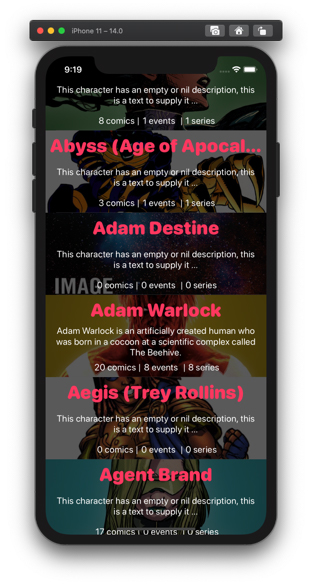
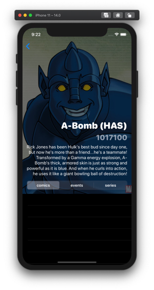
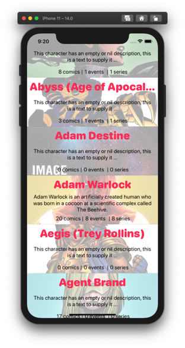
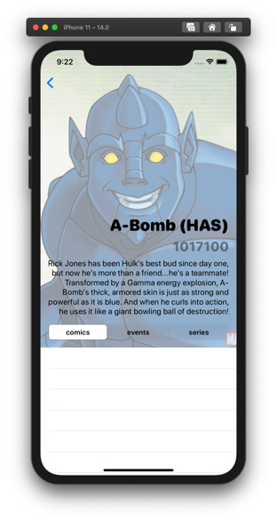
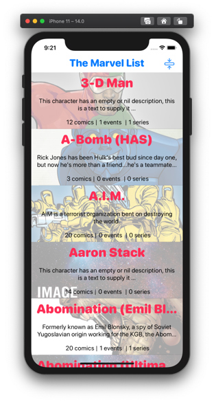

# marvelous
|||
|-|:-:|
||This is a **Swift** App implemented with a **MVVM architecture** and **RxSwift** -  using the *[Marvel Characters API][apiMarvel]* - Please, feel free to comment, feedback are welcome - *I'm still working on it, i will finish a second version soon (October 2020)*|

> *Note: If you like **SwiftUI** or Marvel API, please checkout also my other repo* [myHeroes] 

### Screenshots
|List View|Detail View|List without navBar|
|:-:|:-:|:-:|
|||")|
||||
> *"Data provided by Marvel. © 2014 Marvel"*

## Changelog
### 1.0.0
- [x] Listing some charcters from webservice using a UItableView
- [x] Display basic character details, large header design with a photo ignoring safe area edges that fits full screen
- [x] Cool transparent navigationBar design with customs bar buttons
- [x] A bar button to hide navigation in ListView and pull down tableView to hide 
- [x] Updated UI to **works fine with Dark** and Light modes

[//]: # (links)

   [myHeroes]: <https://github.com/ssuperw/myHeroes>
   [apiMarvel]: <https://developer.marvel.com/docs>
